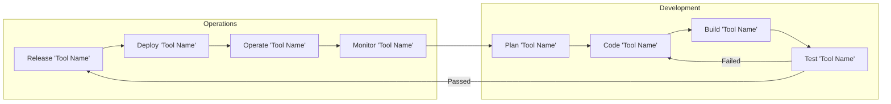

```mermaid
graph LR


    subgraph Operations
        Release[Release 'Tool Name']
        Deploy[Deploy 'Tool Name']
        Operate[Operate 'Tool Name']
        Monitor[Monitor 'Tool Name']
    end

    subgraph Development
        Plan[Plan 'Tool Name']
        Code[Code 'Tool Name']
        Build[Build 'Tool Name']
        Test[Test 'Tool Name']
    end


    Plan --> Code
    Code --> Build
    Test --Passed--> Release
    Release --> Deploy
    Deploy --> Operate
    Operate --> Monitor
    Monitor --> Plan
    Build --> Test
    Test -- Failed --> Code

```

